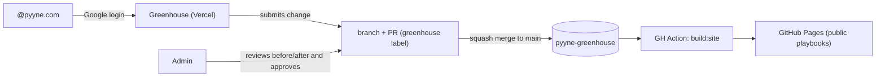

# Pyyne Greenhouse 🌱

Where ideas are planted, matured, and grow until they become playbooks.

Pyyne's visual playbook editor: anyone with a `@pyyne.com` Google account can suggest changes through visual editing; admins review a **before/after** view and approve; deployment to GitHub Pages is automatic.

---

## Tech stack

### Core framework

| Technology | Version | What it is used for |
|---|---|---|
| [Next.js](https://nextjs.org) 15 (App Router) | `^15.3` | The whole editor app: pages, layouts, server components, API routes (`/api/proposals/*`, `/api/auth/*`) and middleware. Deployed on Vercel. |
| [React](https://react.dev) 19 | `^19.1` | UI components. The same block components render in the editor (client), in previews (SSR) and in the static site build (`renderToStaticMarkup`). |
| [TypeScript](https://www.typescriptlang.org) 5 | `^5.7` | Everything is typed; `npm run typecheck` runs `tsc --noEmit`. |

### Styling

| Technology | Version | What it is used for |
|---|---|---|
| [Tailwind CSS](https://tailwindcss.com) v4 | `^4` | All app screens. Brand tokens live in the `@theme` block of `src/app/globals.css` (forest/sage/leaf/moss palette, Outfit/Newsreader/JetBrains Mono fonts). |
| Custom design system | — | The playbook content look lives in `shared/playbook/styles/` (`.pb-*` classes, one CSS file per block component), driven by CSS custom properties injected per playbook from the JSON `theme` object. `shared/playbook/playbook.css` is just the bundle index (`@import`s); the static build inlines them. Shared by the app preview and the static site. |
| [Phosphor Icons](https://phosphoricons.com) | `^2` | UI icons via `<PhIcon name="…">` (web font, regular weight). |

**Style organization (project convention):** class strings live outside components, in `src/styles/` — `tokens.ts` (colors/fonts for JS use), `ui.ts` (shared primitives: buttons, inputs, badges, diff text), and one file per screen (`home.ts`, `shell.ts`, `editor.ts`, `proposals.ts`, `history.ts`, `standalone.ts`). Components import constants (`className={home.statCard}`) instead of inline class soup.

### Data, auth and integrations

| Technology | Version | What it is used for |
|---|---|---|
| [zod](https://zod.dev) | `^3.24` | The playbook JSON schema (`shared/playbook/schema.ts`). Every playbook is validated on read, on proposal submit, and at static build time. Block types are a zod discriminated union, so TypeScript types are inferred from the schema. |
| [Auth.js (next-auth)](https://authjs.dev) v5 | `^5.0.0-beta` | Google OAuth restricted to `@pyyne.com` (`hd` parameter + server-side domain check in the `signIn` callback). JWT sessions carry the `isAdmin` flag. |
| [@octokit/app](https://github.com/octokit/app.js) + [@octokit/rest](https://github.com/octokit/rest.js) | `^15` / `^21` | GitHub App authentication and API calls: creating branches, committing JSON files, opening/merging/closing PRs, labels and comments. There is **no database** — Git is the audit trail. |
| [diff](https://github.com/kpdecker/jsdiff) | `^7` | Per-word text diffs (`diffWords`) inside the structural before/after comparison shown to reviewers. |

### Tooling

| Technology | Version | What it is used for |
|---|---|---|
| [tsx](https://tsx.is) | `^4.19` | Runs the TypeScript scripts (`build:site`, `migrate:interviewer`) without a compile step. |
| GitHub Actions | — | `.github/workflows/deploy-pages.yml` builds the static site and deploys to GitHub Pages on every merge to `main`. |
| Vercel | — | Hosts the editor app (server-side OAuth secrets and GitHub App key cannot live on GitHub Pages). |

---

## How it works



1. **Content** lives as versioned JSON: `content/playbooks/<slug>.json` — the single source of truth.
2. **Proposals** are pull requests created by the server via the GitHub App. Proposal metadata (author, type, summary) travels in an HTML comment inside the PR body.
3. **Before/after review**: the API fetches the JSON from `main` and from the PR branch, aligns blocks by `id` and renders a visual diff (added/removed/moved/changed blocks + per-word text diffs) with author, avatar and date.
4. **Approval rule** (server-side): the approver must be in `content/admins.json`; an admin cannot approve their own proposal, except emails with `canSelfApprove: true`.
5. **Publishing**: merge to `main` triggers the Pages workflow; `scripts/build-site.ts` renders every playbook to static HTML.

---

## Repository structure

```
├── src/
│   ├── app/                      # Next.js App Router
│   │   ├── page.tsx              # Home: "The Archive" — playbook gallery
│   │   ├── login/                # Google sign-in screen
│   │   ├── new/                  # New-playbook wizard → /new/editor (create mode)
│   │   ├── playbooks/[slug]/     # Playbook preview (PlaybookShell)
│   │   │   ├── edit/             # Visual editor (canvas + structure + changelog panel)
│   │   │   └── history/          # Version history + /[n] snapshot detail
│   │   ├── proposals/            # Proposal list
│   │   │   └── [n]/              # Before/after review + discussion (ProposalView)
│   │   └── api/
│   │       ├── auth/[...nextauth]/  # Auth.js handler
│   │       └── proposals/        # GET/POST list+create, [n]/approve, [n]/reject, [n]/comment
│   ├── lib/
│   │   ├── auth.ts               # Auth.js v5 config (Google, pyyne.com check, isAdmin in JWT)
│   │   ├── session.ts            # getSession + auth bypass (dev mode without Google creds)
│   │   ├── guards.ts             # requireUser / requireAdmin for pages and API routes
│   │   ├── admins.ts             # Reads content/admins.json (bundled via static import)
│   │   ├── github.ts             # GitHub App → authenticated Octokit client
│   │   ├── content.ts            # Playbook reads: GitHub Contents API in prod, fs in dev
│   │   ├── proposals.ts          # PR lifecycle: create branch+PR, list, merge, reject, comments
│   │   ├── history.ts            # Version history (merged PRs) + snapshots at a commit
│   │   └── time.ts               # timeAgo helper
│   ├── auth.config.ts            # Edge-safe Auth.js subset used by middleware (no node:fs)
│   ├── middleware.ts             # Protects /edit, /proposals, /new, /api/proposals
│   ├── components/               # shell (AppShell/AppSidebar/NavLink), home/, brand/, fields.tsx
│   └── styles/                   # Class constants per screen (Tailwind) — see convention above
│
├── shared/playbook/              # THE HEART — shared by the app AND the static build
│   ├── schema.ts                 # zod schemas: Playbook, Page, Block (discriminated union), Theme
│   ├── types.ts                  # TS types inferred from the schemas + proposal types
│   ├── theme.ts                  # defaultTheme (Pyyne tokens) + theme→CSS variables
│   ├── playbook.css              # Bundle index — @imports only
│   ├── styles/                   # Design system split per component (.pb-*):
│   │   │                         #   tokens, base, layout, typography, card, hero,
│   │   │                         #   alert, checklist, timeline, badge, contributors,
│   │   │                         #   table, format-card, letter-cards, media, responsive
│   ├── icons.tsx                 # Named inline SVG icon registry
│   ├── blocks/index.tsx          # One React component per block type + <BlockView> router
│   ├── PlaybookShell.tsx         # Full layout (topbar, sidebar, pages) for preview/static
│   ├── RichText.tsx              # Safe renderer for the <strong>/<em> inline subset
│   ├── factory.ts                # Block/page/playbook factories + palette labels (BLOCK_LABELS)
│   └── diff.ts                   # Structural playbook diff + per-word text diff
│
├── content/
│   ├── playbooks/<slug>.json     # The playbooks (source of truth, schema-validated)
│   └── admins.json               # [{ email, canSelfApprove }]
│
├── scripts/
│   ├── build-site.ts             # Static site generator → out/ (GitHub Pages)
│   └── migrate-interviewer.ts    # One-shot migration from the legacy config.js
│
├── .github/workflows/deploy-pages.yml
└── public/assets/                # Pyyne logo (used by app and static site)
```

### Why `shared/playbook` is separate

Block components, the schema and the theme are imported by **two** runtimes: the Next.js app (client + SSR) and the static site generator (`renderToStaticMarkup` in Node, outside Next). Keeping them Next-free (no `next/link`, no `next/image`) is what makes the dual use possible — do not import Next-specific modules there.

---

## The content model

A playbook JSON has four sections (schema v1, see `shared/playbook/schema.ts`):

```jsonc
{
  "schemaVersion": 1,
  "meta":   { "slug", "title", "description", "version", "lastUpdated", "tags", "favicon" },
  "theme":  { "colors": { "brand", "brandDark", …22 tokens }, "fonts", "radii", "layout" },
  "nav":    [ { "group": "Getting Started", "pageIds": ["overview"] } ],
  "pages":  [ { "id", "label", "icon", "eyebrow", "title", "subtitle", "blocks": [ … ] } ]
}
```

Every block is `{ "id", "type", "props" }`. The 19 block types:

| Group | Types |
|---|---|
| Structure | `hero`, `subHeading`, `separator`, `richText` |
| Cards | `card`, `cardGrid`, `formatCards`, `letterCards` |
| Lists | `checklist`, `timeline`, `pillRow`, `qaList`, `contributors` |
| Data | `table`, `changelog` |
| Callouts | `alert`, `quote`, `ctaButton`, `image` |

## How change detection works (the diff engine)

Proposals are reviewed as a **visual before/after**, computed by `diffPlaybooks()` in
`shared/playbook/diff.ts` from two JSON documents: the playbook on `main` ("before") and
the playbook on the proposal branch ("after").

### Identity: blocks have stable ids

Every block carries a unique `id` generated at creation time (`newId()` in
`shared/playbook/factory.ts`). Editing a block's props keeps its id; duplicating a block
creates a new one. Display order is just the array position in `pages[].blocks[]` — so
identity never depends on position.

### The three diff levels

1. **Structural** — pages and blocks are aligned by `id` and classified as `added`
   (only in after), `removed` (only in before), `changed` (same id, different JSON), or
   `moved` (same id, different relative order). Meta, theme and nav are compared the
   same way at the top level.
2. **Field** — for a `changed` block, `flattenObject()` flattens nested props into
   dotted paths (`props.items.2`, `props.title`) and each differing leaf becomes a
   `FieldChange { path, before, after }`.
3. **Text** — each changed string field gets a per-word diff (`diffWords` from the
   `diff` package), rendered as green inserted / red struck-through spans.

### Move detection: longest increasing subsequence

A naive "same id, different index" test produces false moves: inserting one block at the
top shifts every later index by one, flagging the whole page as moved. Instead,
`diffBlocks()` computes moves by **relative order**:

1. Take the blocks present on both sides, in "after" order
2. Map them to their "before" indices — e.g. moving `b` to the top turns
   `[a, b, c]` → `[b, a, c]` into the sequence `[1, 0, 2]`
3. Compute the **longest (strictly) increasing subsequence** (LIS) of that sequence —
   here `[1, 2]`, i.e. `b` and `c` kept their relative order
4. Blocks outside the LIS are the true moves (here only `a`, reported `0 → 1`)

Inserts and removals don't disturb the LIS of the surviving blocks, so they never
produce phantom moves. A swap is reported as a single move (either side is an equally
minimal description).

### Rendering the review

The proposal screen (`src/app/proposals/[n]/ProposalView.tsx`) turns the diff into
cards: added blocks are rendered as real components, removed blocks render dimmed,
changed fields show the word-level diff, theme changes show before/after color
swatches, and moves show "moved from position X to Y". Approving squash-merges the PR;
the Pages workflow rebuilds the static site.

### Adding a new block type

1. Add a variant to the `BlockSchema` discriminated union in `shared/playbook/schema.ts`
2. Register the type name in `BLOCK_TYPES` and its palette label in `BLOCK_LABELS` (`factory.ts`)
3. Add a factory default in `createBlock` (`factory.ts`)
4. Add a render case in `BlockView` (`shared/playbook/blocks/index.tsx`) + a `shared/playbook/styles/<block>.css` file (registered as an `@import` in `playbook.css`)
5. Add an inspector form in `src/app/playbooks/[slug]/edit/BlockInspector.tsx`

The diff engine, proposals flow and static build pick it up automatically.

---

## Local development

```bash
npm install
npm run dev          # editor at http://localhost:3000
npm run build:site   # generates the static site in out/
npm run typecheck    # type checking
```

Without the GitHub App env vars, the app runs in local mode: it reads `content/playbooks/*.json` from disk and the "Submit" button returns 503.

### Auth bypass (current default)

While `AUTH_GOOGLE_ID` is unset, the app runs in **auth bypass mode**: everyone is automatically signed in as the first admin from `content/admins.json` (shown as "Dev (auth bypass)" with a `bypass` badge in the header), and all routes are open. As soon as the Google credentials are configured, real OAuth takes over with no code change. Force a mode explicitly with `AUTH_BYPASS=true|false`.

## Production setup (one time)

### 1. Google OAuth (login @pyyne.com)

1. Google Cloud Console → APIs & Services → Credentials → **Create OAuth client ID** (Web)
2. Authorized redirect URI: `https://<your-app>.vercel.app/api/auth/callback/google` (and `http://localhost:3000/api/auth/callback/google` for dev)
3. OAuth consent screen: **Internal** type (Workspace) — restricts access to pyyne.com
4. Copy the Client ID/Secret

### 2. GitHub App (proposals as PRs)

1. `pyyne-digital` org Settings → Developer settings → GitHub Apps → **New GitHub App**
2. Repository permissions: **Contents: Read & write**, **Pull requests: Read & write**, **Issues: Read & write** (labels/comments)
3. Webhook: disabled
4. Install the app **only** on the `pyyne-greenhouse` repo
5. Generate a **private key** and note the App ID + Installation ID (in the installation URL)

### 3. Vercel

1. Import the `pyyne-digital/pyyne-greenhouse` repo
2. Env vars (see `.env.example`):
   - `AUTH_SECRET` — `npx auth secret`
   - `AUTH_GOOGLE_ID`, `AUTH_GOOGLE_SECRET`
   - `GITHUB_APP_ID`, `GITHUB_APP_PRIVATE_KEY` (with `\n` for line breaks), `GITHUB_APP_INSTALLATION_ID`
   - `GITHUB_REPO_OWNER=pyyne-digital`, `GITHUB_REPO_NAME=pyyne-greenhouse`
3. Auto-deploys on every push to `main` (content always fresh)

### 4. GitHub Pages

Settings → Pages → Source: **GitHub Actions**. The workflow `.github/workflows/deploy-pages.yml` handles the rest. Site at `https://pyyne-digital.github.io/pyyne-greenhouse/`.

## Editing admins

`content/admins.json`:

```json
{
  "admins": [
    { "email": "pedro.mihael@pyyne.com", "canSelfApprove": true },
    { "email": "another.admin@pyyne.com", "canSelfApprove": false }
  ]
}
```

Changes to this file go through the normal PR flow.
