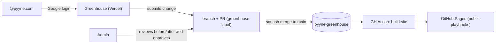

# Pyyne Greenhouse 🌱

Where ideas are planted, matured, and grow until they become playbooks.

Pyyne's visual playbook editor: anyone with a `@pyyne.com` Google account can suggest changes through visual editing; admins review a **before/after** view and approve; deployment to GitHub Pages is automatic.

## How it works



- **Content** lives as versioned JSON: `content/playbooks/<slug>.json` (schema in `shared/playbook/schema.ts`).
- **Proposals** are PRs created by the server via a GitHub App — no database; Git is the audit trail.
- **Admins** live in `content/admins.json`. An admin cannot approve their own proposal, except those with `canSelfApprove: true`.
- **Published playbooks**: static site generated by `scripts/build-site.ts` and deployed to GitHub Pages on every merge to `main`.

## Local development

```bash
npm install
npm run dev          # editor at http://localhost:3000
npm run build:site   # generates the static site in out/
npm run typecheck    # type checking
```

Without the GitHub App env vars, the app runs in local mode: it reads `content/playbooks/*.json` from disk and the "Submit" button returns 503. Auth requires the Google env vars.

## Production setup (one time)

### 1. Google OAuth (login @pyyne.com)

1. Google Cloud Console → APIs & Services → Credentials → **Create OAuth client ID** (Web)
2. Authorized redirect URI: `https://<your-app>.vercel.app/api/auth/callback/google` (and `http://localhost:3000/api/auth/callback/google` for dev)
3. OAuth consent screen: **Internal** type (Workspace) — restricts access to pyyne.com
4. Copy the Client ID/Secret

### 2. GitHub App (proposals as PRs)

1. `pyyne-digital` org Settings → Developer settings → GitHub Apps → **New GitHub App**
2. Repository permissions: **Contents: Read & write**, **Pull requests: Read & write**, **Issues: Read & write** (labels/comments)
3. Webhook: disabled
4. Install the app **only** on the `pyyne-greenhouse` repo
5. Generate a **private key** and note the App ID + Installation ID (in the installation URL)

### 3. Vercel

1. Import the `pyyne-digital/pyyne-greenhouse` repo
2. Env vars (see `.env.example`):
   - `AUTH_SECRET` — `npx auth secret`
   - `AUTH_GOOGLE_ID`, `AUTH_GOOGLE_SECRET`
   - `GITHUB_APP_ID`, `GITHUB_APP_PRIVATE_KEY` (with `\n` for line breaks), `GITHUB_APP_INSTALLATION_ID`
   - `GITHUB_REPO_OWNER=pyyne-digital`, `GITHUB_REPO_NAME=pyyne-greenhouse`
3. Auto-deploys on every push to `main` (content always fresh)

### 4. GitHub Pages

Settings → Pages → Source: **GitHub Actions**. The workflow `.github/workflows/deploy-pages.yml` handles the rest. Site at `https://pyyne-digital.github.io/pyyne-greenhouse/`.

## Editing admins

`content/admins.json`:

```json
{
  "admins": [
    { "email": "pedro.mihael@pyyne.com", "canSelfApprove": true },
    { "email": "another.admin@pyyne.com", "canSelfApprove": false }
  ]
}
```

Changes to this file go through the normal PR flow.

## Structure

```
├── src/app/                 # Next.js App Router (editor, proposals, API)
├── src/lib/                 # auth (Auth.js), GitHub App, content, proposals
├── shared/playbook/         # zod schema, React blocks, theme, diff — shared by app/build
├── content/playbooks/*.json # the playbooks (source of truth)
├── content/admins.json      # admins and approval rules
├── scripts/build-site.ts    # static site generator (GitHub Pages)
└── scripts/migrate-interviewer.ts  # one-shot migration from the old repo
```
