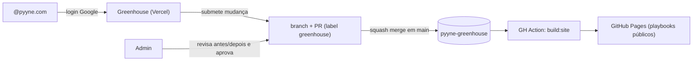

# Pyyne Greenhouse 🌱

Onde ideias são plantadas, maturadas e crescem até virarem playbooks.

Editor visual de playbooks da Pyyne: qualquer pessoa com conta Google `@pyyne.com` pode sugerir mudanças com edição visual; admins revisam um **antes/depois** e aprovam; o deploy no GitHub Pages é automático.

## Como funciona



- **Conteúdo** vive em JSON versionado: `content/playbooks/<slug>.json` (schema em `shared/playbook/schema.ts`).
- **Propostas** são PRs criados pelo servidor via GitHub App — sem banco de dados; o Git é a auditoria.
- **Admins** ficam em `content/admins.json`. Admin não aprova a própria proposta, exceto quem tem `canSelfApprove: true`.
- **Playbooks publicados**: site estático gerado por `scripts/build-site.ts` e publicado no GitHub Pages a cada merge em `main`.

## Desenvolvimento local

```bash
npm install
npm run dev          # editor em http://localhost:3000
npm run build:site   # gera o site estático em out/
npm run typecheck    # checagem de tipos
```

Sem as envs do GitHub App, o app roda em modo local: lê `content/playbooks/*.json` do disco e o botão "Submeter" retorna 503. Auth exige as envs do Google.

## Setup de produção (uma vez)

### 1. Google OAuth (login @pyyne.com)

1. Google Cloud Console → APIs & Services → Credentials → **Create OAuth client ID** (Web)
2. Authorized redirect URI: `https://<seu-app>.vercel.app/api/auth/callback/google` (e `http://localhost:3000/api/auth/callback/google` para dev)
3. OAuth consent screen: tipo **Internal** (Workspace) — restringe a pyyne.com
4. Copie Client ID/Secret

### 2. GitHub App (propostas como PRs)

1. Settings da org `pyyne-digital` → Developer settings → GitHub Apps → **New GitHub App**
2. Permissões de repositório: **Contents: Read & write**, **Pull requests: Read & write**, **Issues: Read & write** (labels/comentários)
3. Webhook: desabilitado
4. Instale o app **somente** no repo `pyyne-greenhouse`
5. Gere uma **private key** e anote App ID + Installation ID (na URL da instalação)

### 3. Vercel

1. Importe o repo `pyyne-digital/pyyne-greenhouse`
2. Env vars (ver `.env.example`):
   - `AUTH_SECRET` — `npx auth secret`
   - `AUTH_GOOGLE_ID`, `AUTH_GOOGLE_SECRET`
   - `GITHUB_APP_ID`, `GITHUB_APP_PRIVATE_KEY` (com `\n` nas quebras), `GITHUB_APP_INSTALLATION_ID`
   - `GITHUB_REPO_OWNER=pyyne-digital`, `GITHUB_REPO_NAME=pyyne-greenhouse`
3. Deploy automático a cada push em `main` (conteúdo sempre fresco)

### 4. GitHub Pages

Settings → Pages → Source: **GitHub Actions**. O workflow `.github/workflows/deploy-pages.yml` cuida do resto. Site em `https://pyyne-digital.github.io/pyyne-greenhouse/`.

## Editando admins

`content/admins.json`:

```json
{
  "admins": [
    { "email": "pedro.mihael@pyyne.com", "canSelfApprove": true },
    { "email": "outro.admin@pyyne.com", "canSelfApprove": false }
  ]
}
```

Mudanças nesse arquivo seguem o fluxo normal de PR.

## Estrutura

```
├── src/app/                 # Next.js App Router (editor, propostas, API)
├── src/lib/                 # auth (Auth.js), GitHub App, conteúdo, propostas
├── shared/playbook/         # schema zod, blocos React, tema, diff — compartilhado app/build
├── content/playbooks/*.json # os playbooks (fonte da verdade)
├── content/admins.json      # admins e regras de aprovação
├── scripts/build-site.ts    # gerador do site estático (GitHub Pages)
└── scripts/migrate-interviewer.ts  # migração one-shot do repo antigo
```
